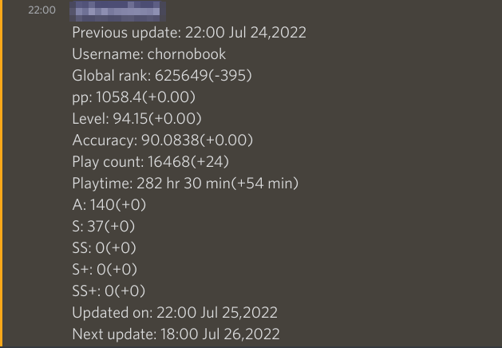

# statosu-discord
statosu is a Discord bot that helps you to track your progress in osu!! classic mode.
## How to use statosu?
To track your statistic with statosu you have to do three simple steps:
1. add bot to your Discord channel
2. set your nickname in osu!
3. set when you want to get statistic
### How to do that?
statosu has three simple commands:
- !about - help
- !nickname **your-nickname** - sets your osu! nickname
- !date **period**[daily, weekly, monthly] [number-of-month(0-28), day-of-week] **update_hour**(0-23) - sets update period and time.
## Example of the update message

## How to deploy
If you want to deploy statosu you have to run application with such properties: 
- bot.token - token of your Discord bot
- client.id - id of your osu! client
- client.secret - osu! client's secret 